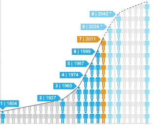

# Analisis de datos de internet en Argentina

## Descripcion
En este repositorio contiene el Analisis de datos de internet en Argentina en donde contiene un archivo EDA  donde se analiza la informacion de los tipos de tecnologia , la velocidades utilizadas , las provincias con mayor acceso, etc... tambien este repositrorio contine un Dashboard desarrollado en streamlit donde de manera mas interactiva se pude visualizar  las tablas y graficas presentadas en el EDA. 

##  DashBoard

### **Contenido**

 📈El dashboard contiene 7 paginas principales en las cuales cada una hace analisis de una rubrica , las paginas son:
- Acceso a Internet por provincia
- Acceso por velocidades
- Acceso por tecnologia
- Comportamiento en el tiempo
- Penetracion de poblacion
- Ingresos
- KPI's

📈Visulizacion Power BI

#### **Acceso a Internet por provincia**

En esta pagina se visualizan tablas y graficas del acceso a internet que tienen por cada provincia y por partido mostrando los 10 partidos con mayor acceso a Internet para la provincia seleccionada.

  

#### **Acceso por velocidades**

En esta pagina contiene las graficas en donde se visualizan la cantidad de accesos a los diferentes tipos de velocidades destacando el uso de los 300 y 100 Mbps.Ademas, contien las graficas en donde se puede observar las 5 velocidades que tienen mayor acceso para las 6 provincias que tienen  mayor y menor acceso a internet.

  

#### **Acceso por tecnologia**

En esta pagina contiene las graficas donde se visualiza el porcentaje de acceso a las tecnologias de Fibra optica , Cable Modem , ADSL , Wireless, entre otras. Tambien se visualiza el comportamiento en el tiempo del numero de accesos para cada tecnologia.Otras de las graficas dentro de esta pagina es la taza promedio de crecimiento de cada tecnologia y las provinicas que tienen mayor acceso para cada tecnologia.

  

#### **Comportamiento en el tiempo**

En esta pagina se encuentran las graficas en donde se puede visualizar el comportamiento en el tiempo de el acceso promedio de velocidades y la taza de crecimiento totales.Tambien se puede visualizar graficas de la velocidad promedio para las provincias seleccionadas asi como tambien la taza promedio de crecimiento de la velocidad para cada provincia.

  

#### **Penetracion de poblacion**

En esta pagina se encuentran las graficas relacionadas a la penetracion de internet en hogares y habitantes . Donde se puede observar su comportamiento en el tiempo y la penetracion por cada provincia.

  

#### **Ingresos**

En esta pagina se visualiza la cantidad de ingresos por año en un periodo de 2014 - 2024

  

#### **KPI's**

En esta pagina se encuentran graficados los KPI's

- Aumento de 2% acceso al servicio de internet por provincia
- Aumento 5% del numero de accesos de fibra optica para el proximo trimestre , para todas las provinicias
- Acceso de 0 % a la tecnologia de ADSL en 2 años ( tomando la taza de crecimiento)

## Acceso al DashBoard

Para acceder al dasboard ingresar a la siguiente enlace :

URL : https://datanalytics01.streamlit.app/

## Visualizacion Powe BI

<table>
  <tr>
    <td>
      
    </td>
    <td style="vertical-align: top; padding-left: 20px;">
      <h3>Título del Texto</h3>
      

        Este es un texto explicativo que aparece exactamente al lado derecho de la imagen.
        Aquí puedes extender la descripción todo lo que quieras, y siempre se mantendrá alineado correctamente.
      

    </td>
  </tr>
</table>

## Contenido del repositorio

Este repositorio cuenta con tres carpetas las cuales se describen a continuacion :

- imagenes : En esta carpeta se encuentran las imagenes utilizadas en el dashboard y en el presente archivo readme
- pages : Es el codigo de cada una de las paginas del dashboard
- venv : Es en entorno virtual python

A continuacion se hace una breve descripcion de los archivos que se encuentran dentro del repositorio : 
 - dasboard.py : Es el archivo principal del dashboard en donde se ejecuta streamlit para la visualizacion de la pagina web
 - EDA.ipynb : Es el notebook que contiene la graficas y analisis de la data
 - Internet.xlsx : Archivo que conteiene la informacion
 - requiremnts.txt : Archivo en donde se localizan las librerias utilizadas

## Librerias utilizadas

Algunas de las librerias utilizadas en este proyecto son :

- Streamlit
- Pandas
- Plotly

Para ver la lista completa de librerias con su version acceder al archivo requirements.txt de este repositorio.

## Autor

Rogelio Cortez Rosas

**Contacto **

correo : rcortezrosas@gmail.com

Git hub user : RogerCortezRosas